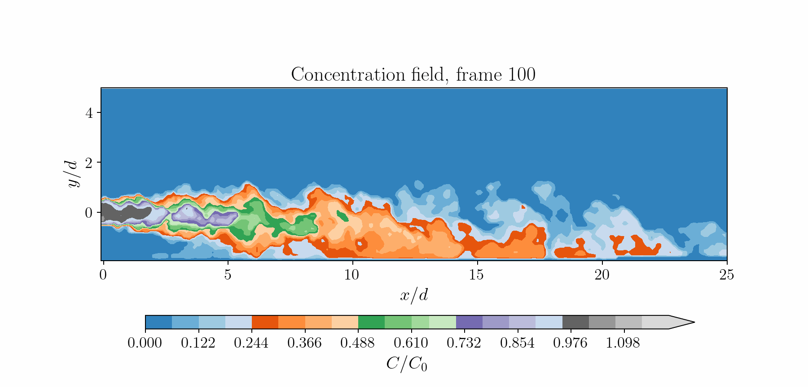

I am Sina Tahmooresi, a PhD candidate in Civil Engineering at the University of Ottawa, 
specializing in environmental fluid mechanics. My research focuses on turbulent jets, 
scalar transport, and the interaction of buoyant flows with solid boundaries. I combine experimental techniques, including PIV, PLIF, and simultaneous PIV–PLIF measurements, 
with computational modelling using OpenFOAM, Nek5000 via LES and RANS. 
I am also interested in sediment transport, turbulence modelling, and data-driven methods for fluid mechanics.

  <table width="760">
    <tr>
      <td align="center">
        
         
        <em>
          Figure: Visualization of characteristic oscillatory flapping and mixing in a turbulent dense jet under counterflow conditions.
        </em>
      </td>
    </tr>
  </table>

  <table width="760">
    <tr>
      <td align="center">
        
         
        <em>
          Figure: Concentration field development in a confined dense jet, measured using simultaneous PIV–PLIF.
        </em>
      </td>
    </tr>
  </table>

  <table width="760">
    <tr>
      <td align="center">
        
         
        <em>
          Figure: Near-field instantaneous flow structures of a non-buoyant offset jet obtained from experiments and LES.
        </em>
      </td>
    </tr>
  </table>

## My Work

- **Experimental fluid mechanics:** PIV, PLIF, and simultaneous PIV–PLIF measurements of turbulent dense and non-buoyant jets.
- **Computational fluid dynamics:** RANS, LES, and DNS modelling using OpenFOAM and Nek5000.
- **Turbulence and scalar transport:** Investigation of mixing, coherent structures, turbulent fluxes, anisotropy, and turbulent Schmidt numbers.
- **Environmental hydraulics:** Modelling of marine outfalls, sediment transport, scour, and hydraulic structures.
- **Scientific computing:** Development of Python, C++, and Fortran workflows for large-scale data processing, visualization, and modal analysis.
- **Data-driven modelling:** Application of machine learning and physics-guided methods to fluid-flow reconstruction.
